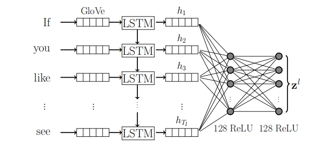

# Tensor Fusion Network (TFN)

## Architecture

### Modality Embedding Subnetworks

#### Spoken Language Embedding Subnetwork

口语与书面文本（如评论、推文）在构成性和语法上有显著不同。例如：“我觉得还行……嗯……让我想想……嗯……不……好吧，嗯”。这种形式的意见在书面语言中很少出现，但它的变体在口语中非常常见。第一部分传达了实际信息，其余部分则是说话者大声思考，最终同意了第一部分的内容。

处理口语这种不稳定性质的关键因素是建立能够在不可靠和独特的言语特征存在的情况下运作的模型，重点关注言语中的重要部分。

这种分析揭示了口语情感分析的复杂性，强调了口语表达的随意性和思维过程的外化。为了有效地处理口语中的情感分析，模型需要具备以下能力：

1. **捕捉重要信息**：即使在冗长和不连贯的表达中，也能识别和提取关键的情感信息。
2. **处理噪音和中断**：能够忽略无关的填充词和自言自语部分，只关注实际传达的信息。
3. **理解口语特征**：包括语调、停顿和重复等独特的口语特征，这些特征在情感表达中起到重要作用。

通过专注于这些重要方面，情感分析模型可以更准确地理解和分类口语中的情感，从而提高分析的准确性和可靠性。

##### Methodology

文中提出的应对口语挑战的方法是，在每个单词间隔学习丰富的口语表征，并将其作为全连接深度网络的输入。

第 i 个单词的丰富表征包含了从语篇开始到时间以及第 i 个单词的信息。这样，当模型随着时间的推移发现语篇的意义时，如果在第 i + 1 个词及其后的任意数量的词中遇到了不可用的信息，直到第 i 个词之前的表征也不会被稀释或丢失。此外，如果模型再次遇到可用信息，它可以通过将这些信息嵌入长短时记忆（LSTM）来恢复。

时间相关编码可用于管道的其他部分，只需利用时间相关嵌入的非线性仿射变换，将注意力集中在相关部分即可，这可以作为一种降维关注机制。为了正式定义我们提出的口语嵌入子网络($U_l$)，让$l = \{l_1, l_2, l_3, ..., l_{T_l}; l_t \in \mathbb{R}^{300}\} $ 作为以300维GloVe词向量序列表示的口语词集。其中，$T_l$是语篇中的字数。

LSTM公式如下

$$
\begin{aligned}
i_t & = \sigma(W_{ii} x_t + b_{ii} + W_{hi} h_{t-1} + b_{hi}) \\
f_t & = \sigma(W_{if} x_t + b_{if} + W_{hf} h_{t-1} + b_{hf}) \\
g_t & = \tanh(W_{ig} x_t + b_{ig} + W_{hg} h_{t-1} + b_{hg}) \\
o_t & = \sigma(W_{io} x_t + b_{io} + W_{ho} h_{t-1} + b_{ho}) \\
c_t & = f_t \odot c_{t-1} + i_t \odot g_t \\
h_t & = o_t \odot \tanh(c_t) \\
\end{aligned}
$$

最终得出一个矩阵 $\bold{h_l} = [h_1; h_2; h_3; \cdots; h_{T_l}]$ 其中 $\bold{h_l}$ 是由所有时间步的$h_t$拼接而成的语言表征矩阵，其作为输入进入全连接层生成语言嵌入$z^l$:
 
$$z^l = U_l(l;W_l) \in \mathbb{R}^{128}$$

#### Visual Embedding Subnetwork

