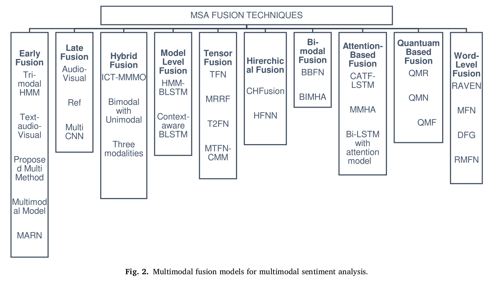

#! https://zhuanlan.zhihu.com/p/701237647
# Multimodal Sentiment Analysis: A Survey 

翻译总结自下文

[Multimodal sentiment analysis: A systematic review of history, datasets, multimodal fusion methods, applications, challenges and future directions](https://www.sciencedirect.com/science/article/pii/S1566253522001634#fig0001)

## MSA Fundamentals

### Modalities

`Uni-Modal`

`Bi-Modal`

Bi-Gram combination of the modalities below:

- **Text**: 分为词组或短语、字符 N-Grams、音素 N-Grams，以及其他文本元素。

- **Image**: 面部表情的例子如微笑和皱眉、手势、姿势、凝视以及目光接触等其他视觉元素

- **Speech(Audio)**: 包括笑声、停顿、声调、哭声和一句话中的声调分布、语速等。

- **EEG Signal**

`Tri-Modal`

All of the three modalities above

#### Text Indicators

只有少数几个词是重要的，其余的词都是停止词或与语义无关的词。

Language Model:

- N-Grams
- Phoneme N-Grams: N-Grams with phonemes

NLP techniques are required.

#### Auditory Indicators

- 停顿：语句中停顿次数越多，表示情感越中性。
  
- 音调：高音表达焦虑或热情，低音表达严肃。

- 强度或能量： 高能量语句的极性通常表现在对一个单词或短语的关注上。
  
#### Visual Indicators

面部表情至关重要。

- 微笑： 微笑表示积极情绪 `<更多>`：摄像头现在可以检测微笑强度，并为其打分。
  
- 凝视、目光接触：表示积极情绪，而如果对方移开目光，则表示消极或中性情绪。

### Basic Methodology

*Multimodal Fusion*

1. Data Preparation: data(structured,semi-structured,unstructured) -> text, image, audio

2. Data Pre-processing: data is cleaned and selected using dimensionality reduction as per problem requirement.

3. Feature Extraction: Audio features are extracted from spoken words in video and temporal images are extracted from video. Transcripts for the text data is generated from speech in video.

4. Feature Fusion: Next from extracted features multimodal feature vector is generated and using various calcification algorithm data is classified. Then classified result is sent to particular application.

### Importance of modalities

1. *Text Modality*: 文本模态在所有模式中占主导地位。它在识别隐藏的情感方面发挥着关键作用。文本情感分析产生了非常好的结果，但现在大多数舆论数据都是以视频而非文本的形式共享的。

2. *Visual Modality*: 视觉特征有助于更好地识别潜在的情感或观点。例如，如果有这样一段文字：“这是相当不错的鼠标”。仅使用文本数据很难识别这是关于原始动物鼠标还是电脑鼠标。在这种情况下，视觉效果会有所帮助，文字和视觉效果的结合会使双模态系统产生比单模态系统更好的结果。
   
3. *Audio Modality*: 声学特征用于从视频中生成文本数据，还可以识别说话者的音调。将所有三种模式结合起来，可以生成更好的分析模型。在幽默、讽刺和常识检测的情况下，视觉可能会做出错误的预测，但结合三种模式就能正确识别情绪。

## Popular Datasets

## MSA fusion techniques

### 1. Early Fusion(Feature Level Fusion)

特征级融合（有时称为早期融合）将来自每种模态（文本、音频或视觉）的所有特征合并为一个单一的特征向量。然后将其输入到分类算法中。特征级融合的优点是它允许在不同的多模态特征之间进行早期关联，这可能会导致任务完成得更好。在应用这种策略时，整合不同元素是一个挑战。这种融合方法的缺点是时间同步，因为所收集的特征属于不同的模态，并且在许多方面可能存在很大差异。因此，在融合过程开始之前，特征需要转换为所需的格式。特征级的模态融合面临着整合广泛不同输入特征的挑战。这意味着在重新训练模态的分类系统时，同步各种输入是一个困难的过程。如何创建由具有不同时间尺度、度量水平和时间结构的不同模态特征组成的可接受的联合特征向量仍是一个未解决的问题。现有的使用特征级数据融合的人类情感分析器将音频和视频特征连接成一个特征向量的做法显然不是答案。这种融合方法无法有效地表示模态内的动态，无法过滤掉从多个模态收集的冲突或冗余数据。

补充：

尽管特征级融合在某些应用中表现出色，但它也存在一些显著的局限性。为了克服这些挑战，研究人员不断探索新的方法，如通过复杂的预处理步骤确保不同模态的数据能够同步，以及开发更先进的特征选择和提取技术，以减少冗余和噪音。此外，随着深度学习技术的发展，基于深度学习的特征融合方法也越来越受到关注。这些方法通过深层神经网络自动学习特征表示，能够更好地处理异构数据的融合问题，提高融合模型的性能和泛化能力。在实际应用中，特征级融合和其他融合方法（如决策级融合）的结合使用，往往能够发挥各自的优势，实现更好的任务表现。

### 2. Late Fusion(Decision Level Fusion)

在晚期融合中，首先独立处理和分类每种模态的特征。然后将分类结果融合形成一个最终决策向量，进而得出情感预测。由于融合发生在分类之后，这种过程被称为晚期融合。由于早期融合的挑战，大多数研究人员选择决策级融合（也称为分类器融合，即晚期融合），其中每种模态的输入分别建模，并在最后整合单模态识别结果。在机器学习和模式识别领域，决策级融合是当前的热门话题。许多研究证明，分类器融合比单独的分类器更优越，因为来自不同分类器的错误是不相关的。由于来自多种模态的决策通常具有相同的数据形式，不同模态的决策融合比特征级融合更容易。此外，这种融合过程的另一个好处是，每种模态都可以使用最佳的分类器或模型来学习其特征。然而，当分析任务需要不同的分类器时，决策级融合步骤中所有这些分类器的学习过程变得困难且耗时。

补充：

晚期融合方法在情感分析、图像识别和多模态信息处理等领域得到了广泛应用，因其能够综合各模态的优势，提高最终决策的准确性和鲁棒性。研究人员不断优化决策级融合技术，以应对不同模态数据之间的异构性和复杂性，使其在各类实际应用中表现出色。

### 3. Hybrid Fusion

这是一种早期融合和晚期融合技术的混合方法。该融合方法结合了特征级融合和决策级融合技术。研究人员利用混合融合方法，既可以享受特征级融合和决策级融合的优势，又可以避免各自的缺点。

补充：

这种混合融合技术在多模态数据处理中表现出色，特别是在需要同时考虑低层次和高层次特征的应用场景中。通过结合早期融合和晚期融合的优点，可以实现更高的融合效果和更强的模型鲁棒性。

在具体应用中，混合融合通常包括以下步骤：

1. **特征级融合（早期融合）**：在这个阶段，来自不同模态的数据首先被处理和特征提取，然后在特征层面进行融合。这种方法可以捕捉到跨模态的相关性，适合于需要紧密集成多种模态信息的任务。
   
2. **决策级融合（晚期融合）**：在这个阶段，每个模态的数据分别被处理和分类，最后在决策层面进行融合。通过独立处理每个模态的数据，可以保留每个模态的独特信息，并在最终决策时综合各模态的结果，提高整体的决策准确性。

混合融合方法的优势包括：

- **综合优势**：结合特征级和决策级融合的优点，可以更全面地利用多模态数据的信息。
  
- **鲁棒性增强**：通过在特征和决策层面同时进行融合，可以提高模型在处理复杂和多样化数据时的鲁棒性。
  
- **灵活性**：混合融合方法具有较高的灵活性，可以根据具体应用需求调整特征级和决策级融合的比例和方式。

例如，在图像和文本联合处理的应用中，特征级融合可以用于捕捉图像和文本之间的细粒度关联，而决策级融合则可以用于结合各自分类结果，形成更加精确的最终决策。这种混合融合方法已经在图像识别、语音处理和多模态情感分析等领域中得到了广泛应用。通过混合融合技术，研究人员能够开发出性能更优的模型，更好地解决多模态数据处理中的挑战。

### 4. Model-level Fusion

对不同模态的特征进行研究，旨在发现它们之间是否存在关联。基于研究领域和问题需求，构建所需的模型。这是一种结合多种模态数据并利用相关性进行融合的技术。研究人员在考虑问题空间的同时，创建了符合他们研究需求的模型。

补充：

这种融合方法称为松弛融合（relaxed fusion），通过结合来自多个模态的数据（如图像、文本、音频等），可以提高模型的准确性和鲁棒性。松弛融合在处理多模态数据时尤其有效，因为它可以利用不同模态的互补信息，从而在复杂的任务中获得更好的性能。

在实践中，松弛融合通常涉及以下几个步骤：

1. **特征提取**：从每个模态中提取有用的特征。
   
2. **特征关联**：研究和分析这些特征之间的关联性。
   
3. **模型构建**：基于特征关联性构建融合模型。
   
4. **模型训练和验证**：使用训练数据对模型进行训练，并使用验证数据评估模型的性能。

这种方法在许多领域都有广泛的应用，包括图像识别、语音处理、自然语言处理和生物医学信号分析等。通过融合多模态数据，研究人员可以开发出更加全面和精确的模型，从而更好地解决实际问题。

### 5. Tensor Fusion

这种方法使用张量融合层，通过构建模态嵌入的三重笛卡尔积，明确地模拟了单模态、双模态和三模态的交互。它减少了所需的训练样本数量。

补充：

张量融合（Tensor Fusion）是一种先进的多模态数据融合技术，特别适用于深度学习应用。该方法通过创建模态嵌入的三重笛卡尔积，将来自不同模态（例如文本、音频和视觉）的特征表示结合成一个多维张量。这种张量能够捕捉到单模态、双模态以及三模态之间的复杂交互关系。

### 6. Hierarchical fusion

它是一种独特的特征融合方法，以层次顺序工作，首先将两两模态合并，最后再将所有三种模态合并。该简单方法的问题在于它无法过滤掉从其他模态收集到的矛盾或冗余数据。我们开发了一种分层技术来处理这个主要问题，从单模态到双模态向量，再从双模态到三模态向量逐步推进。在两种模态的融合中，对于每个双模态组合，如T + V（文本 + 视觉）、T + A（文本 + 音频）和A + V（音频 + 视觉），它融合了语句特征向量。然后使用三个双模态特征生成一个三模态特征。

### 7. Bimodal Fusion

在双模态融合中，基于成对的模态表示，一个新颖的端到端网络实现了融合（相关性增加）和分离（差异性增加）。这两个组件同时训练，使它们能够在模拟的对抗中相互竞争。由于模态之间已知的信息不平衡，模型以两个双模态配对作为输入。

### 8. Attention mechanism-based Fusion

多模态情感分析和情绪识别中的两个最重要的困难是上下文信息提取和多模态融合。基于双向循环神经网络的多层上下文特征提取模型被称为基于注意机制的融合。在话语级别上，每种模态对情感和情绪分类的贡献不同。因此，模型建议使用基于注意力的跨模态融合来适应每个跨模态话语的重要性。上下文关注的单模态特征逐一组合形成双模态特征，然后将它们全部合并成三模态特征向量。在每个融合步骤之后提取上下文特征。

### 9. Quantum based fusion

量子基础融合利用量子干涉和量子测量理论。使用量子干涉捕获每个话语内部的相互作用（即不同模态之间的相关性），并使用强弱影响模型来检测此方法中连续话语之间的相互作用（即一个说话者如何影响另一个），该模型采用量子测量方法开发。它还利用决策级别或后期融合方法。

### 10. Word level fusion

在这种策略中，为了获得更优越的情感趋势，会检查多个模态之间的交互。Transformer被用于学习话语的联合表示，并在不同模态之间进行转换。Memory Fusion Network（MFN）是一种用于多视角序列学习的递归模型，由三部分组成：

1. 长短期记忆（LSTM）网络，用于编码每个视图独特的动态和交互作用。

2. Delta-memory Attention Network 是LSTMs系统中的一种特殊注意机制，旨在找到跨不同记忆维度的跨视图和时间关系。

3. Multi-view Gated Memory（MVGM）是一个统一的记忆，记录了随时间变化的跨视图交互。

## Challenges

根据上述研究结果，今后的研究应解决以下问题：需要建立一个多语言的强大多模态数据集。数据集应具有良好的注释(well-annotated)和精细的分级(fine-graded)。需要重点解决共参照解析问题，隐藏情绪、讽刺和挖苦的检测(hidden emotions, irony, and sarcasm detection)仍然是一个使用多种模态(Co-reference)的开放式研究问题。数据集的准备和分析应符合道德规范(ethically)，并广泛提供给公共领域(public domains)，以便更好地开展研究，实现机会均等。不同模态的内隐和外显含义(implicit and explicit meaning)，以及代码混合的文本数据、文本中使用的简短表单、嘈杂和低分辨率的照片和视频(code-mixed text data, short forms used in text, noisy and low-resolution photos and videos)，以及不同模态的内隐和外显含义，都必须加以研究。除上述内容外，多语言方向的研究课题还包括处理多语言数据、提高跨领域准确性、提高跨数据集准确性(multilingual data, cross-domain accuracy improvement, cross-dataset accuracy improvement)以及利用上下文背景(contextual backdrop)进行情感分析。

长期以来，识别讽刺(sarcasm)或挖苦(irony)等隐藏情感的问题一直令该学科的学者们苦恼不已。由于这些情感在文本中没有直接表现出来，因此被称为隐性情感(concealed emotions)。人类通过两种线索来感知这些情绪：非语言交流和语境(nonverbal communication and context)。利用多模态情感分析来检测非语言线索和上下文，可以利用同样的线索来检测隐藏情感。多模态情感分析是一个新的研究领域。以往的大多数研究都成功地证明，将两种或三种输入类型结合起来可以提高分析的准确性。对情感分析中语境的功能进行了研究，得出的结论是语境能提高分类准确性。未来可能的研究方法是将多模态线索和上下文结合起来，重点是识别隐藏的情绪。

情感分析中的特征提取面临许多问题，包括领域特异性（这意味着它无法在其他领域发挥作用）、冗余、高维度、渣词、代码混合数据、偏差和上下文依赖性。(domain specificity (which means it won't function in other domains), redundancy, high dimensionality, slag words, code-mixed data, biassing, and context-dependency) 

下面列出了其中的一些困难。

### Code-Mixed Data

它是在同一语句中使用两种或两种以上语言的信息。语码混合（Code-Mixing）是将一种语言的语言特点，如短语、单词和语素，嵌入另一种语言的语句中。Main kal movie dekhne jaa rahi thi and raaste me I met Rima "就是语码混合的例子。基于规则和深度学习的方法也面临着代码混合的挑战。在这一领域的发展还很少

### Biasing

情感分析工具经常用于医疗保健等领域，这些领域涉及咨询等敏感话题。来自不同背景的客户来电和营销线索经常会被检查情绪指标，获得的数据会推动重要的决策。因此，识别偏见至关重要，尤其是在涉及人口统计数据时。偏见有多种形式，包括性别、肤色、年龄等。

### Context Dependency

情感词的使用因主题而异。当与其他词或短语连用时，表面上看似中性的词也会带有感情色彩。例如，当某人想买一栋大房子来休闲时，"大"（big）这个词就会有积极的含义。然而，在这种情况下，同样的词可能会引起负面情绪，比如大房子很难打扫。遗憾的是，情感分析研究很少关注这一因素。

## Future Scope

MSA 的设计融合了许多独特的概念，这些概念推动了研究目标的实现，尤其是在情感分析和情感识别领域。它也是评论和推荐系统以及健康预测系统的基础。研究 MSA 架构的进步是一个令人兴奋的研究课题，它有可能成为应用最广泛的自然语言处理方法之一。

### Mental health prediction

随着越来越多的人被诊断出患有抑郁症和其他精神疾病，能够识别抑郁症和其他精神疾病的自动心理健康预测正成为一个重要的研究领域。在美国，每四个成年人中就有一个患有精神疾病，因此精神健康成为一个重要的优先事项。在 Xu 等人最近的研究中[link](https://aclanthology.org/2020.lrec-1.772/)，使用 10 倍交叉验证在用户层面进行评估。因此，来自同一用户的帖子会出现在训练集或测试集中，但不会同时出现在训练集和测试集中。使用的分类器如下决策树（DT，最大深度= 4）；自适应提升（AB）；带线性核的支持向量机（SVMLinear）。此外，在实验中，使用 TensorFlow 库实现了一个双层神经网络分类器。具体来说，使用了一个整流线性单元（ReLU）作为隐层的激活函数，并使用一个 sigmoid 函数将输出概率限制在 0 和 1 之间。在另一项工作[link](https://www.hindawi.com/journals/jhe/2021/9356452/)中，他们利用机器学习实现了早期和晚期融合，根据计算机交互、身体姿势、面部表情和心率变异性四种模式预测一个人是否有压力。他们利用迁移学习来预测 NASA-TLX 分数，该分数以 0 到 100 的等级来预测一个人的压力水平，并提供了一种机制来存储监测一个人的精神状态的数据，因为在给定的时间轴上，任务负荷会不断增加。在 Aloshban 等人的另一项研究[link](https://link.springer.com/article/10.1007/s12559-020-09808-3)中，采用了用于序列建模的双向长短期记忆网络以及包括语言和声音特征在内的多模态特征。它应用了后期融合、联合表示和门控多模态单元。与单模态相比，它产生了更好的结果。

### Emotion recognition

情感与人类密不可分，因此情感理解是类人人工智能（AI）的重要组成部分。由于可以从 Facebook、YouTube、Reddit、Twitter 等平台上的大量公开会话数据中挖掘观点，会话中的情感识别（ERC）作为自然语言处理（NLP）领域的一个新研究前沿正变得越来越受欢迎。它还可用于医疗保健系统（作为心理分析工具）、教育（了解学生的挫折感）和其他领域。此外，ERC 对于创建情绪感知交互至关重要，因为这种交互需要掌握用户的情绪。ERC存在许多障碍，包括会话上下文建模、对话者的情绪转变等，所有这些都增加了这项任务的难度[link](https://ieeexplore.ieee.org/document/8764449)。在 ER 领域的另一项工作中，引入了一个上下文和情感感知框架，称为 Sentic GAT。在 Sentic GAT 中，常识知识由上下文和情感感知图注意机制动态表示，上下文语篇的内部和相互依赖关系由基于分层多头注意的对话转换器获得。相互依赖和内部依赖指的是上下文信息及其自身关键信息对目标语篇的依赖关系[link](https://ieeexplore.ieee.org/document/9706271)。

### Sarcasm detection

讽刺是使用词语或成语来表达与实际意思相反的意思。人们用讽刺来取笑或谴责他人。讽刺是多模态情感分析中使用的一个概念，用来描述人们的态度，即人们可以用正面的词语或表达方式来传达不良情绪，用负面的词语或表达方式来传达积极情绪。它的功能是极性翻转干扰对象。讽刺情感分析是 FULL（NLP）研究的一个快速扩展领域。它包括单词、短语和句子层面的分类，以及文档和观点层面的分类。讽刺情感检测可根据使用的文本特征分为三类：词汇、语用和夸张。由于文字的具象性，伴随着细微差别和隐含意义，检测讽刺情绪极为困难。近年来，这一研究领域已成为 NLP 领域的一个主要问题，许多论文提供了处理这一任务的各种策略。语音和文本领域的贡献最大。讽刺往往不使用语言指标，而是依赖于非语言和语言线索。语调变化、过分强调词语和板着脸都是讽刺的表现。采用多模态策略来判定讽刺的作品非常少[link](https://ieeexplore.ieee.org/abstract/document/9260964)。其中一些研究包括 Castro 等人的研究[link](https://arxiv.org/abs/1906.01815)，他们为多模态讽刺研究创建了一个新的数据集 MUStARD，该数据集具有高质量的注释，包括多模态和对话语境特征。该数据集还提供了对话中作为语境信息的前一转折。因此，研究人员总结说，MUStARD 的这一特性为今后的工作带来了新的子任务：对话语境中的讽刺检测。在 Du 等人的另一项研究[link](https://link.springer.com/article/10.1007/s12559-021-09832-x)中，他们提出了一种双通道卷积神经网络，可以分析目标文本的语义及其情感语境。他们使用 SenticNet 为长短时记忆（LSTM）模型添加常识。然后应用注意力机制，将用户的表达习惯考虑在内。

### Fake news detection

社交媒体和其他平台上的虚假新闻十分普遍，由于其可能对社会和国家造成重大危害和负面影响，因此引起了人们的高度关注。假新闻的检测已经成为一项重要的研究课题。2020 年，有关健康的假新闻泛滥，世界健康受到威胁。2020 年 2 月初，世界卫生组织发出警告，COVID-19 疫情导致了大规模的 "信息瘟疫"，即真假新闻的爆发，其中包含大量错误信息。这是一个几乎没有开展工作的地区。在 Patwa 等人的研究中[link](https://link.springer.com/chapter/10.1007/978-3-030-73696-5_3)，他们描述并发布了一个假新闻检测数据集，其中包含 10,700 条与 COVID-19 相关的假新闻和真新闻。数据集收集了来自各种社交媒体和事实核查网站的帖子，并对每个帖子的真实性进行了人工验证。这些数据具有类别平衡性，可用于开发假新闻和谣言自动检测算法。使用机器学习算法对所开发的数据集进行基准测试，并将其作为潜在的基线。在各种机器学习模型中，基于 SVM 的分类器在测试集上的表现最好，F1 分数高达 93.32%。

### Hate speech detection

仇恨言论用于表达对特定群体的蔑视。它也可用于任何社交媒体，让该群体成员难堪或贬低他们的人格。社交媒体上的仇恨言论白纸黑字，贬低他人，可能会伤害受害者或将其置于危险境地。它是一种带有偏见的、不被接受的、残酷的言论，针对的是一个人或一个群体，因为他们的一些最恶劣的特征。互联网上的仇恨言论，尤其是 Twitter 等微博网站上的仇恨言论，可能已成为近十年来最严重的问题。由于恶意的仇恨宣传，仇恨犯罪在一些国家急剧增加。虽然仇恨言论检测是一个新兴的研究领域，但信息网络中与话题相关的仇恨的产生和传播还有待研究。Masud 等人的研究[link](https://ieeexplore.ieee.org/abstract/document/9458789)预测了 Twitter 上仇恨言论的发起和传播。通过分析我们抓取并人工标注仇恨言论的大型 Twitter 数据集，我们发现了制约仇恨传播的多个关键因素（外源信息、用户的话题亲和力等）。在 Araque 和 Iglesias 的另一项研究中[link](https://link.springer.com/article/10.1007/s12559-021-09845-6)，他们使用了机器学习框架，使用了不同特征的集合。他们还研究了不同特征提取方法的效果，如 TF-IDF 和 SIMilarity-based sentiment projectiON (SIMON)。他们使用了五个不同的数据集，涵盖激进化和仇恨言论检测任务。

### Deception detection

欺骗的定义是劝说或说服他人相信不真实的事情。它被描述为发送信息的目的是向接收者灌输虚假的信念。在这个计算机辅助互动的数字时代，大多数用户都关心如何辨别真假信息。这对于具有高风险因素的活动尤为重要。网上银行、购物以及健康或财务指导等关键领域的信息搜索就是几个例子。在 Chebbi 和 Jebara 的研究中[link](https://link.springer.com/article/10.1007/s11042-021-11148-9)，他们使用音频、视频和文本模式来自动分辨欺骗和真实，并正在研究将这些模式合并，以更精确地识别欺骗。首先对每种模态进行了单独研究，然后提出了一种特征和决策级融合策略来整合这些模态。所提出的特征级融合方法研究了多种特征选择技术，以便从整个使用的特征集中选择最相关的特征，而决策级融合方法则基于信念理论，并考虑到了每种模态的确定度信息。为此，我们使用了一个真实的视频数据集，该数据集来自美国法庭的公开审理，内容是人们进行真实或虚假的互动。

### Stress detection

当今文化中存在多种类型的压力，它们都会对我们的身心健康产生影响。压力被定义为从平静状态向热情状态的过渡，其目的是保持一个人的完整性。压力会对人的工作/生活效率产生一系列不利影响，包括决策能力下降、情景意识降低和工作表现不佳。在 Sander 等人[link](https://www.cambridge.org/core/journals/journal-of-management-and-organization/article/abs/openplan-office-noise-is-stressful-multimodal-stress-detection-in-a-simulated-work-environment/F3EF8D2DF47767F18CBF5C081D6AB3A0)的一项研究中，采用了重复测量实验设计，让同一个人在两种噪音条件下工作，这两种噪音条件都经过精心设计，以模拟典型的开放式办公室和私人办公室噪音水平。Mou 等人的另一项研究[link](https://www.sciencedirect.com/science/article/pii/S0957417421001342)提出了一个利用基于注意力的深度学习技术通过多模态融合检测驾驶员压力的框架。具体来说，他们提出了一种基于注意力的卷积神经网络（CNN）和长短期记忆（LSTM）模型，用于融合非侵入式数据，包括眼睛数据、车辆数据和环境数据。在此基础上，所提出的模型可以自动分别从每种模式中提取特征，并通过自我关注机制对不同模式的特征给予不同程度的关注。

### Multimodal robust systems

创建多模式稳健系统是一项艰巨的任务。一些基准研究试图改进基线结果，使系统更加稳健。人工智能仍在努力应对需要常识推理的复杂任务，如自然语言理解。Cambria 等人的研究[link](https://www.scopus.com/record/display.uri?eid=2-s2.0-85144392306&origin=inward&txGid=5b6bccf33f290bceb7113b880a0faea1)创建了一个基于常识的神经符号框架，旨在克服情感分析中的这些问题。特别是，他们采用了无监督和可重现的子符号技术，如自动回归语言模型和核方法，来建立可信的符号表示，将自然语言转换成一种原语言，从而以完全可解释和可说明的方式从文本中提取极性。在 Zou 等人的另一项研究[link](https://www.scopus.com/record/display.uri?eid=2-s2.0-85119699661&origin=inward&txGid=8dbc0a66ef855062534a3efccff50881)中，通过应用多种理论创建了一个更强大的系统。他们从信息论的角度开发了一种新颖的多模态融合架构，并利用光探测与测距（LiDAR）相机融合网络展示了该架构的实用性。首次创建了作为联合编码模型的多模态融合网络，其中每个单节点、层和管道都表示为一个通道。在另一项研究[link](https://link.springer.com/chapter/10.1007/978-3-319-97598-6_2)中，多模态情感分析方面的大部分研究都是在训练和测试分裂中存在说话者重叠的数据集上进行的。由于每个人表达情绪和情感的方式都是独一无二的，因此必须找到通用的、与人无关的情感分析特征。然而，由于这种重叠，模型已经观察到了某个个体的行为，因此结果并不能真正实现泛化。在实际应用中，模型应该对个体差异具有鲁棒性。

## Latest variable multimodal sentiment analysis models

[GESentic (real-time GPU–ELM multimodal sentiment analysis) (2017)](https://www.scopus.com/record/display.uri?eid=2-s2.0-85016172277&origin=inward)

在过去的五到七年中，大约有177篇文章展示了Sentic表情（能够产生大多数人类情感的基本输入）在ELM和GPU的集成应用中用于实时多模态情感分析。为了改善从多样的模态中提取特征的性能，该方法利用了各种友好于GPU的方法。此外，情感分析模型是使用基于获取特征的复杂ELM分类器构建的。

[CSFC (Convolutional Fuzzy Sentiment Classifier) (2019)](https://www.sciencedirect.com/science/article/pii/S0167865519301394)

卷积模糊情感分类器是一种结合了深度卷积神经网络和模糊逻辑的模型。大多数短语包含混合情感，比如讽刺，这只能通过模糊隶属函数成功地描述。深度学习被用来从每种模态中提取信息，然后投影到一个单一的情感空间中，该空间被聚类成不同的情感。它利用模糊逻辑分类器来预测情感空间中某种情感的程度，因为现实世界中的人对某个观点目标可能存在部分或混合的感觉。

[HALCB Hierarchal Attention-BiLSTM (Bidirectional Long-Short Term Memory) model based on Cognitive Brain limbic system (2020)](https://www.sciencedirect.com/science/article/pii/S0925231220315174)

这是一种受认知神经科学启发的多模态融合技术。HALCB将多模态情感分析分为两个模块。每个模块负责一个任务：二元分类或多元分类。前一个模块识别输入项的极性，并在将它们分别发送到后一个模块之前将它们分成两组。在这个模块中使用了哈希技术来提高检索的准确性和速度。后一个模块中有一个专门用于处理正面输入的正面子网络，而另一个则专门用于处理负面输入的负面子网络。为了匹配其各自的角色，每个二元模块和多元分类模块中的两个子网络都有独立的融合方法和决策层。在最终的链接中，还额外添加了一个随机森林，用于收集所有模块的输出并在决策层进行融合。

[AHRM (Attention-based Heterogeneous Relational Model) (2020)](https://ieeexplore.ieee.org/abstract/document/9127891)

Attention-based Heterogeneous Relational Model (AHRM)被用于对包括内容和社会关系在内的多模态情感进行分类。在这种方法中，采用了渐进式双重注意力模块，用于在从内容信息的角度学习联合图像-文本表示之前收集图像和文本之间的相关性。在这里提出了一个通道注意力模式，用于突出语义丰富的图像通道，并基于关注的通道提出了一个区域关注模式，以强调情感区域。然后，除了学习高质量的社交图像表示之外，还开发了一个异构关系网络，用于聚合社会情境中的内容信息，这扩展了图卷积网络。它与Flicker和GI数据集一起使用。它分为四个部分：(1) 单模态表示学习，使用视觉和文本视角学习单模态图片表示。(2) 渐进双重图像-文本注意力，通过两种创新的跨模态注意力（通道注意力和区域注意力），将图像-文本相关性嵌入联合图像-文本表示。(3) 异构关系融合，从社会关系中创建一个异构关系网络，并扩展GCN以收集社会设置中的内容信息，作为开发高质量图像表示的补充。(4) 情感预测，最终负责情感分类。

[SFNN: Semantic Features Fusion Neural Network (2020)](https://ieeexplore.ieee.org/document/9230015?denied=)

这是一个语义特征融合神经网络（SFNN）。该模型首先利用卷积神经网络和注意机制获取图像的有效情感特征表达。然后将情感特征表达映射到语义特征级别。最后，通过将图像的物理级别的情感特征与视觉模态的语义特征合并，高效地检查评论的情感极性。基于语义级别的特征融合可以减少异构数据之间的差异。

[SWAFN: Sentimental Words Aware Fusion Network (2020)](https://aclanthology.org/2020.coling-main.93/)

该方法将情感术语知识引入融合网络，指导学习多模态方面的组合表示。该方法分为两部分：浅层融合和聚合。为了获得融合的浅层表示，它应用了跨模态竞争技术，从每两个模型中获取双向上下文信息。为了支持和引导三种模态的深度融合，并获取最终的情感词感知融合表示，它构建了一个情感词分类的多任务聚合组件。分析使用了CMU-MOSI、CMU-MOSEI和YouTube数据集。

[MISA: Modality-Invariant and -Specific Representations for Multimodal Sentiment Analysis (2020)](https://dl.acm.org/doi/10.1145/3394171.3413678)

MISA是一个独特的框架，将每种模态分为两个子空间，然后将它们融合起来预测情感状态。第一个子空间是模态不变的。在这个子空间中，来自不同模态的表示学习共享共性，并缩小它们之间的差距。所有话语的模态都被映射到具有分布对齐的共同子空间中。尽管多模态信号来自各种来源，但它们都共享说话者的动机和目标，这些因素决定了话语的整体情感状态。第二个子空间是模态特定的，对每种模态都是独特的，并包含其区别性特征。作为共享子空间上的对齐投影，不变映射有助于捕获这些潜在的共性和相关特征。它利用了MOSI和MOSEI数据集。

[MAG-BERT (Multimodal Adaption Gate-Bidirectional Encoder Representations from Transformers) (2020)](https://aclanthology.org/2020.acl-main.214/)

这个MAG-BERT模型结合了BERT和XLNet的核心架构，并结合了一个经过适当开发的多模态适应门（MAG）。由于MAG，BERT和XLNet现在可以在微调过程中接收到多模态的非语言数据。它通过使BERT和XLNet转换为内部表示来实现这一点，这取决于视觉和音频模态。MAG基本上利用对非语言行为的注意力，将信息丰富的视觉和音频组件转换为具有轨迹和幅度的向量。对于多模态情感分析，它采用了CMU-MOSI和CMU-MOSEI数据集。通过对MAG-BERT和MAG-XLNet进行微调，以及对BERT和XLNet进行语言方面的微调，大大提高了情感分析的性能，超过了先前的基线。

[M2Lens (2021)](https://ieeexplore.ieee.org/abstract/document/9552921)

这是一个新的解释性可视分析工具，可以帮助多模态机器学习模型的开发者和用户更好地理解和诊断用于情感分析的多模态模型。M2Lens通过考虑特征重要性，利用后续解释性技术，从全局子集和局部水平分析多模态语言模型学习到的内部模态和模态间交互。此外，它允许对多模态元素及其对情感分析模型判断的影响进行多方面的调查。M2Lens由四个主要视角组成。它说明了三种不同形式的交互（主导、补充和冲突）对模型预测的影响。此外，多模态特征模板和可视化图形使得探索一组经常使用且具有影响力的特征集更加容易。

[Persian multimodal sentiment analysis framework (2021)](https://www.sciencedirect.com/science/article/pii/S0925231221002666)

这是一个创新的波斯语多模态情感分析框架，以一种与语境相关的方式合并听觉、视觉和文本元素。它首次为波斯语言的话语和从YouTube视频中提取的情感极性创建了多模态数据集。在这个上下文感知的多模态融合框架中，采用了自动特征提取方法，如卷积神经网络（CNN）和长短期记忆（LSTM），来提取单模态和多模态特征。不同的特征被组合起来进行多模态情感分析。展示了利用上下文感知的多模态策略来克服波斯语中模糊词的限制。

[TCM-LSTM (Temporal Convolutional Multimodal LSTM) (2021)](https://ieeexplore.ieee.org/document/9387606)

这个方法是用来从一个新的角度研究语音和视觉LSTM中的跨模态动态，其中语言方面是最重要的。在每个LSTM变体内引入了一个精心设计的门控机制，通过相关的辅助模态增强语言表示。它由两个主要部分组成：(1) 具有听觉和视觉组件的LSTM，以改善口语语言的表示。在每个LSTM变体中都包含了一个精心设计的门控机制，用于评估是否应该基于每个模态中表达的辨别信息进行听觉和视觉增强。(2) 通过将“通道相互依赖学习”模块整合到传统的TCN中，生成了一个“通道感知”的时间卷积网络。

[MMIM (MultiModal InfoMax) (2021)](https://arxiv.org/abs/2109.00412)

多模态Infomax（MMIM）是一个多模态融合框架，通过分层地最大化单模态输入配对（跨模态）和多模态融合结果之间的互信息（MI）来维护与任务相关的信息。为了避免关键任务相关数据的丢失，MI最大化发生在输入和融合级别。据我们所知，这是将MI与MSA联系起来的第一次尝试。为了解决难以处理的问题，该公式包括参数学习和具有稳定和平滑参数估计的非参数GMM。

[OMSKELM (Optimal Multimodal Sentiment classification using the Kernel Extreme Learning Classifier) (2021)](https://onlinelibrary.wiley.com/doi/abs/10.1002/cpe.6259)

该系统在进行多模态情感分析之前考虑了文本、音频和视频之间的关系。首先提取了一组独特的特征。然后，利用一种新的混合蜂群优化算法（HGBEE）对提取的特征进行优化，得到一个具有最佳值的特征集，以提高精度并减少计算时间。接着，利用文本、音频和视频信息创建了基于话语级别的多模态融合。最后，系统采用了多核极限学习分类器（MKELM）进行情感分类。

[TIMF (Two Level Multimodal Fusion) (2021)](https://hindawi.com/journals/scn/2021/6662337/)

在这个系统中，提出了一种两级多模态融合（TlMF）方法，结合了数据级和决策级融合，以完成情感分析任务。在数据级融合阶段使用了张量融合网络来创建文本-音频和文本-视频嵌入，通过分别将文本与音频和视频属性融合。在决策级融合步骤中采用软融合方法，将上游分类器的分类或预测结果融合在一起，以使最终的分类或预测结果尽可能准确。使用CMU-MOSI、CMU-MOSEI和IEMOCAP数据集对其进行测试。

[AWMA (Asymmetric Window Multi Attention) (2021)](https://link.springer.com/article/10.1007/s11042-021-11234-y)

多模态情感分析中，门控循环单元（GRU）模块、不对称窗口注意力（AWA）模块和跨模态注意力（IMA）模块构成了不对称窗口多注意力（AWMA）神经网络。GRU和AWA模块用于捕获单模态动态。IMA模块用于描述跨模态动态。然后逐渐合并三个模块。首先是GRU模块接收输入序列，然后是AWA模块，最后是IMA模块。所提出的方法中，使用不对称窗口来表示在输入数据的特定时间戳处历史和未来上下文的不对称权重是一个新颖的特性。它认为输入数据在特定时间戳处的前后上下文应该是有区别的。此外，不对称窗口可以用来表示上下文的隐含权重。

[Auto-ML based Fusion (2021)](https://ieeexplore.ieee.org/abstract/document/9533552)

该方法分为预处理、个别分类和融合三个阶段。融合方法着重于使用文本和图像组件的独立分类结果进行最终分类。融合策略的目标是通过利用来自两个来源的上下文知识来超越独立分类。使用的数据集是B-T4SA数据集，该数据集由Twitter数据组成。数据集中的每个样本都包含文本和图像。

[Self-MM (Self-Supervised Multi-Task Multimodal sentiment analysis network) (2021)](https://ojs.aaai.org/index.php/AAAI/article/view/17289)

Self-MM模型提出了一种自监督的单模态标签生成过程，可以节省大量时间和金钱。广泛的测试表明，自动生成的单模态标签是可靠且稳定的。通过计算模态表示与类中心之间的距离来计算相对距离值，这与模型输出呈正相关关系。它还设计了一种新颖的权重调整方法，以平衡各种与任务相关的权重损失限制。Self-MM的目标是同时学习一个多模态任务和三个单模态子任务，以创建信息丰富的单模态表示。使用了MOSI、MOSEI和SIMS数据集。

[DISRFN (Dynamic Invariant Specific Representation Fusion Network) (2022)](https://www.hindawi.com/journals/cin/2022/2105593/)

该模型通过结合每种模态的模态不变性和模态特异性表示，更有效地利用了每种模态的冗余信息。在这个模型中，一个简单的动态融合方法可以更快地获取模态之间的交互。DISRFN框架由两部分组成：增强的JDSN和HGFN。首先，使用升级的JDSN模块生成每种模态的模态不变特定联合表示。这允许在模态之间的补充信息被有效利用，同时减少了模态之间的异质性差距。在性能分析实验中使用了MOSI和MOSEI数据集，结果令人满意。

[MH-GAT (Multi-Feature Hierarchical Graph Attention Model) (2022)](https://www.scopus.com/record/display.uri?eid=2-s2.0-85142302561&origin=inward&txGid=7b4d30688459417a885ee32364e4bb4b)

为了分析情感，这项研究提出了一种基于共现和句法依赖图的脑启发式多特征分层图注意模型（MH-GAT）。它通过同时考虑各种结构信息、词性信息和位置关联信息来实现这一目标。该模型包括双图分层注意和多特征融合。输入层包含许多特征，如词性、位置、句法依赖和共现信息。它构建了双图分层注意模型，为每个文本构建了分层图，并开发了一个图注意网络。与最近版本的AT&T BLSTM、文本级GNN和TextING相比，建议的模型的情感分析准确性平均提高了5%。